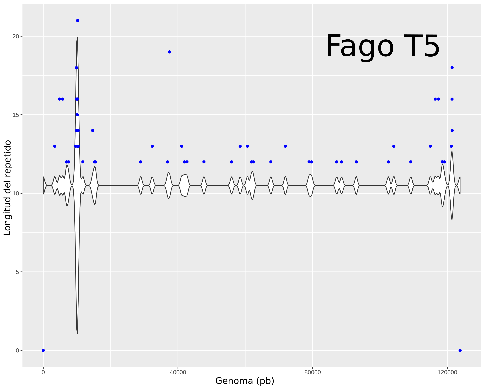

# PARSER for repeat-match based on Mummer package
## Tested with MUMmer 3.0
For more details please check (https://mummer4.github.io/)
## Content:
### 1. repeat-match-parser.sh :repeat:
Determination of direct repeats in several genomes, delimiting the output by setting several parameters.
### 2. repeat-match-parser-one-by-one.sh :repeat:
Determination of cumulative distribution of direct repeats in only one genome.
# 1.-repeat-match-parser :repeat:
## Parameters:
1. Genome order
2. Minimum repeat length
3. Maximum repeat length
4. Minimum distance between repeats
5. Maximum distance between repeats
6. Cut off value
### Execution permissions
Don't forget give execution permissions to script files by typing **chmod +x** repeat-match-parser.sh
### Example
bash repeat-match-parser.sh **genome_order** **12** **35** **120** **1002** **80.72**
### Results
The file of results its named **sorted results** and it has the following columns:

| ID | GL     | DR | RDI| TR | C   | AL    | COV |
| :-------:     | :----: | :-:| :-:| :-:| :-: | :-----:|:---:|
| nc_024789.1   |  109867| 58 | 19 | 77 |70.08| 14.28  | Pass|

**GL**: Genome length
**DR**: Direct repeats
**DRI**: Direct repeats inverted
**TR**: Total repeats 
**C**: Coefficient
**AL**: Average length
**COF**: Cut off value

### Genome order
This script can take as an input more than one genome exclusively in **FASTA FORMAT**, those genomes should be ordered in a list that can be build with **find** *.fasta > **genome_order**
we suggest to use complete genome names to make easier results interpretation.

### Coefficient
It is calculated from the relation between the total number of direct repeats and the genome length then it is multiplied by 1eX, where X is a random value (only for didactical purposes), this normalization attemps to avoid mistakes of interpretation due to rich short repeat genomes. Also it is use to divide sequences in two groups based on the **cut off value** which is defined by the user.

### R-script
This script can generate plots in three dimensions in **ps (postscript)** format, to generate this plots the user should have previously installed R-base, R-script and the library scatterplot, then the process will be authomatic. The script uses two colors that can be changed with minimal knowledgement of R-scripting, it uses the cut off value to divide the genomes in two colors.

Parameters: Minimum repeat length: 12, Maximum repeat length: 35, Minimum distance between repeats: 120, Maximum distance between repeats: 1002.
### Notes:
repeat-match also has an option to do exhaustive searches that can take a lot of of time, for this reason we use the basic option, you can add it by modifying the script adding *-E* after repeat-match line. For short genomes we have not found any differences, but we suggest to check it by yourself.

# 2.-repeat-match-parser-one-by-one.sh :repeat:
In order to analyze specifically only one genome we made an additional script that can produce the following plots:

Points in this plot are represented as the average position of repeat, where the location of rigth and left repeat is averaged and then plotted.
First you should have installed previously some additional libraries called **svglite** and **ggplot2**.
This script take as an input two files, first one is generated by repeat-match-parser and it is found in the folder called **repeat-finder-filtered-files** where you can take the file of the genome you want to plot, and the second is the file in fasta format of that genome.
### Example:
repeat-match-parser-one-by-one.sh **genome** **repeat_filtered_file_of_genome**
### Additional notes:
All plots can be edited in a vector graphics software as https://inkscape.org/

Thanks to **Victor Flores**. :man_teacher:
